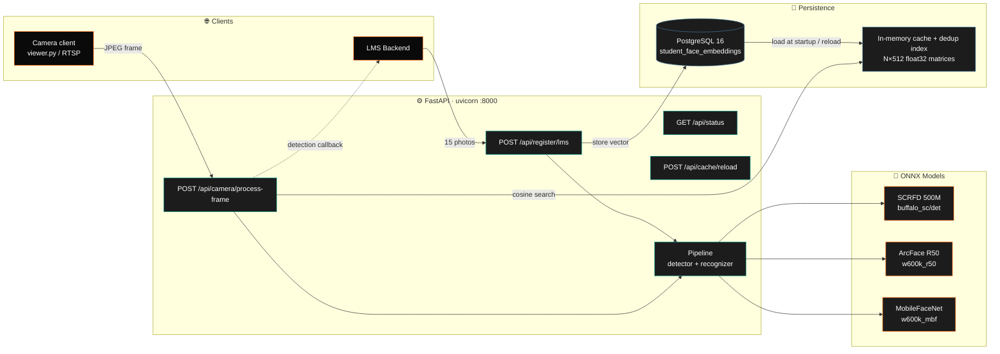
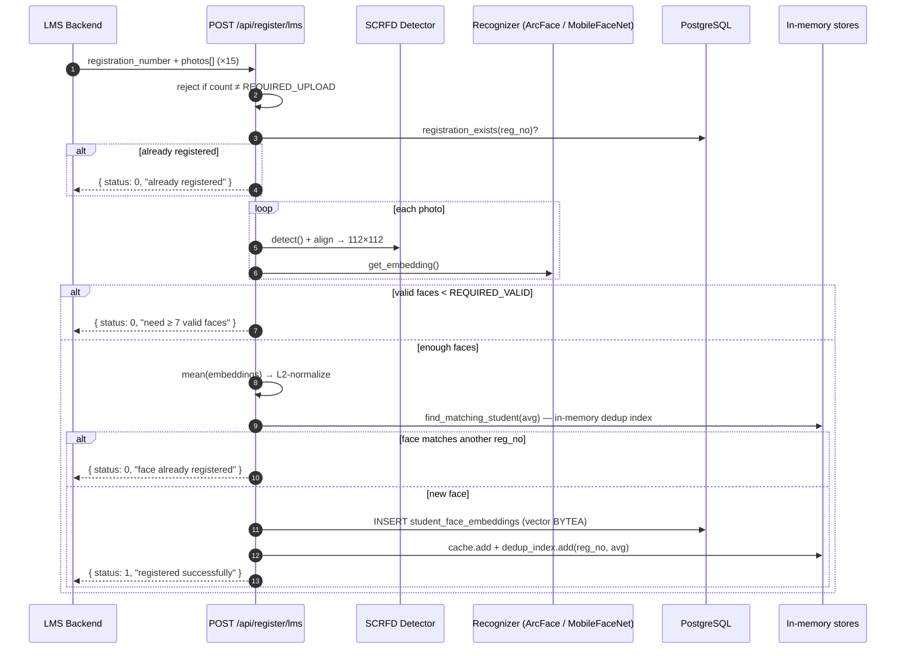
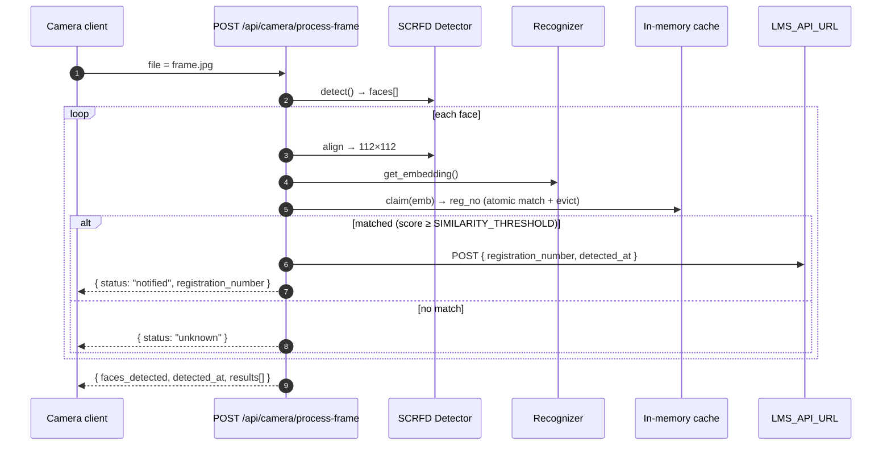
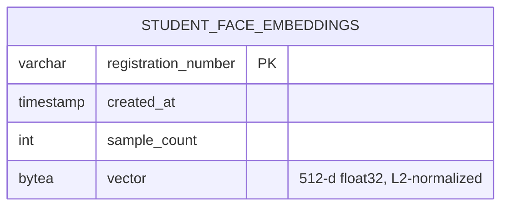

<div align="center">

```
╔══════════════════════════════════════════════════════════════════════════╗
║                                                                          ║
║       █████╗ ██╗      ██████╗ ██╗ ██████╗  ██████╗  ███████╗             ║
║      ██╔══██╗██║      ██╔══██╗██║██╔════╝ ██╔═══██╗ ██╔════╝             ║
║      ███████║██║      ██████╔╝██║██║  ███╗██║   ██║ █████╗               ║
║      ██╔══██║██║      ██╔══██╗██║██║   ██║██║   ██║ ██╔══╝               ║
║      ██║  ██║██║██╗   ██║  ██║██║╚██████╔╝╚██████╔╝ ███████╗             ║
║      ╚═╝  ╚═╝╚═╝╚═╝   ╚═╝  ╚═╝╚═╝ ╚═════╝  ╚═════╝  ╚══════╝             ║
║                                                                          ║
║              S C H O O L  ·  F A C E  ·  A T T E N D A N C E             ║
║                                                                          ║
╚══════════════════════════════════════════════════════════════════════════╝
```

###### A headless, LMS-integrated face-recognition attendance API.
###### FastAPI · ONNX Runtime · SCRFD + ArcFace · PostgreSQL · OpenCV


</div>

---

## ❍ &nbsp; Synopsis

A production-grade face-recognition **backend** for schools, built to plug into an
existing **LMS** — there is no UI of its own. The LMS enrolls a student once by
posting a batch of photos; afterwards a camera client streams frames to the service,
which recognizes each face and fires a detection callback to the LMS in real time.

The split of responsibility is deliberate:

- **This service owns recognition** — face embedding, matching, duplicate rejection.
- **The LMS owns attendance** — it receives `{registration_number, detected_at}` and
  records the attendance row however it likes.

Nothing but the averaged face embedding and the registration number is ever stored.
Source images are decoded in memory and discarded.

The pipeline runs in two interchangeable modes, selected by the `MODE` env var:

| Mode | Detector | Recognizer | Use case |
|------|----------|------------|----------|
| **⚡ Lite**  | SCRFD @ 320×320 | MobileFaceNet (`w600k_mbf.onnx`, 13 MB)  | Low-end PCs, real-time on CPU |
| **🎯 Heavy** | SCRFD @ 640×640 | ArcFace R50    (`w600k_r50.onnx`, 174 MB) | Maximum accuracy, small faces |

Detection and alignment run **directly on ONNX Runtime + OpenCV** — there is no
heavyweight face SDK dependency.

---

## ❍ &nbsp; What Makes It Real

```
  ┌─────────────────────┬──────────────────────────────────────────────┐
  │  API-only           │  Four endpoints, optional API key + CORS.    │
  │                     │  Drops behind any LMS — no frontend to host. │
  ├─────────────────────┼──────────────────────────────────────────────┤
  │  Privacy-first      │  Only the 512-d averaged embedding + reg.    │
  │  storage            │  number persist. Source photos never touch   │
  │                     │  disk — processed in RAM, then discarded.    │
  ├─────────────────────┼──────────────────────────────────────────────┤
  │  Two-way dedup      │  Registration rejects a repeat reg. number   │
  │                     │  AND a face already enrolled under a          │
  │                     │  different number.                            │
  ├─────────────────────┼──────────────────────────────────────────────┤
  │  In-memory search   │  Every embedding lives in one (N,512) NumPy  │
  │                     │  matrix; recognition is a single dot-product │
  │                     │  — zero DB I/O on the hot path.              │
  ├─────────────────────┼──────────────────────────────────────────────┤
  │  Detect-once        │  A student is evicted from the cache the     │
  │                     │  moment they're recognized and the LMS is    │
  │                     │  notified, so they aren't re-notified.       │
  └─────────────────────┴──────────────────────────────────────────────┘
```

---

## ❍ &nbsp; System Architecture



---

## ❍ &nbsp; Registration Flow

The LMS posts **exactly 15 photos** (configurable via `REQUIRED_UPLOAD`); at least **7**
must contain a detectable face (`REQUIRED_VALID`). Each valid face is embedded, the
embeddings are averaged into a single L2-normalized 512-d vector, and the result is
checked against every existing enrollment before it is stored.



---

## ❍ &nbsp; Recognition Flow

A camera client posts a single JPEG per call. Every detected face is matched against
the in-memory cache; on a hit, the LMS is notified and the student is evicted so they
aren't re-notified on the next frame. The match-and-evict is a single atomic `claim()`,
so concurrent frames can never double-notify the same student.



> **Why eviction?** The cache is a "who hasn't been seen yet" set, not a full mirror of
> the DB. Because entries are removed as students are recognized, duplicate-face
> detection at registration uses a **separate, persistent `dedup_index`** (every
> registered embedding, never evicted) rather than the attendance cache — so it never
> needs to re-scan the database.

---

## ❍ &nbsp; Data Model

A single table. No source images, no attendance rows — the LMS keeps those.



```sql
CREATE TABLE IF NOT EXISTS student_face_embeddings (
    registration_number VARCHAR(100) PRIMARY KEY,
    created_at          TIMESTAMP DEFAULT NOW(),
    sample_count        INT DEFAULT 0,
    vector              BYTEA NOT NULL
);
```

> Embeddings are stored as raw `BYTEA` and searched in Python (NumPy dot-product over
> L2-normalized vectors == cosine similarity). No `pgvector` or other extension is
> required.

---

## ❍ &nbsp; Tech Stack

| Layer | Component | Role |
|-------|-----------|------|
| **Web** | FastAPI 0.136 · Uvicorn | REST API; optional API-key auth + opt-in CORS |
| **Detection** | SCRFD 500M on ONNX Runtime (`buffalo_sc/det_500m`) | Face detector + 5-point align (NumPy Umeyama, no insightface dep) |
| **Recognition** | ArcFace R50 / MobileFaceNet (ONNX Runtime 1.25) | 512-d L2-normalized embeddings |
| **Search** | NumPy `(N,512)` matrix dot-product | Cosine similarity, in-process, zero DB I/O |
| **Storage** | PostgreSQL 16 + `psycopg2-binary` (pooled) | One embeddings table; `BYTEA` vectors |
| **Image I/O** | OpenCV 4.9 · NumPy 1.26 | Decode, align, JPEG handling |

---

## ❍ &nbsp; Project Layout

```
school_attendance/
├── main.py                 ← FastAPI app + the 4 endpoints (auth, CORS, upload limits)
├── auth.py                 ← env-gated X-API-Key dependency
├── config.py               ← env vars (DB, MODE, thresholds, security, models, LMS)
├── database.py             ← pooled psycopg2 · EmbeddingCache + DedupIndex · store/lookup
├── schema.sql              ← student_face_embeddings table
├── download_models.py      ← fetch the ONNX models into MODEL_DIR (one-time)
├── requirements.txt        ← runtime deps
├── requirements-dev.txt    ← + pytest
├── Dockerfile              ← container build
├── .env.example            ← copy to .env and fill in
├── viewer.py               ← local webcam → /api/camera/process-frame (testing tool)
│
├── pipeline/
│   ├── scrfd.py            ← SCRFD detector on raw ONNX Runtime
│   ├── align.py            ← ArcFace 5-point norm_crop (NumPy Umeyama)
│   ├── detector.py         ← detector wrapper (lite/heavy det_size) + align
│   └── recognizer.py       ← direct ONNX ArcFace / MobileFaceNet inference
│
├── tests/                  ← pure-logic pytest suite (no DB / models needed)
│
└── scripts/                ← Windows .bat helpers
    ├── start.bat           ← activate venv + uvicorn on :8000
    ├── restart.bat         ← free port 8000, then start
    ├── stop.bat            ← kill server (+ viewer) on :8000
    ├── status.bat          ← curl /api/status, print LAN address
    └── viewer.bat          ← run viewer.py
```

> Face models are **not** vendored. Run `python download_models.py` to fetch them into
> `MODEL_DIR` (default `~/.insightface/models/`) — see setup step 4.

---

## ❍ &nbsp; API Surface

| Method | Path | Purpose |
|--------|------|---------|
| `GET`  | `/api/status` | Health + current mode + pending / registered counts |
| `POST` | `/api/register/lms` | Enroll a student (multipart: `registration_number`, `photos[]` ×15) |
| `POST` | `/api/camera/process-frame` | Recognize faces in one JPEG (`file`) + notify LMS |
| `POST` | `/api/cache/reload` | Reload all embeddings from PostgreSQL (new attendance day) |

> **Auth:** when `API_KEY` is set, send it as an `X-API-Key` header on every endpoint
> **except** `GET /api/status` (left open for health checks). When `API_KEY` is empty,
> the endpoints are open (backward-compatible default).

### `GET /api/status`

```json
{ "status": "running", "mode": "heavy", "students_pending": 42, "registered_total": 1280 }
```

### `POST /api/register/lms`

Multipart form: `registration_number` (string) + `photos[]` (exactly 15 image files,
≥ 7 with a detectable face).

```bash
curl -X POST http://localhost:8000/api/register/lms \
  -H "X-API-Key: $API_KEY" \                      # omit if API_KEY is unset
  -F "registration_number=2026-CS-001" \
  -F "photos[]=@1.jpg" -F "photos[]=@2.jpg" ...  # 15 files total
```

```jsonc
// success
{ "success": true,  "status": 1, "message": "Face registered successfully" }
// failures (HTTP 200, status 0):
//   "Exactly 15 photos required, received N"
//   "registration_number <X> is already registered"
//   "Only N photo(s) had a detectable face, at least 7 required"
//   "This face is already registered under registration_number <Y>"
```

### `POST /api/camera/process-frame`

Multipart form: `file` (one JPEG/image; max `MAX_UPLOAD_BYTES`, default 10 MB → else `413`).

```bash
curl -X POST http://localhost:8000/api/camera/process-frame \
  -H "X-API-Key: $API_KEY" -F "file=@frame.jpg"
```

```json
{
  "faces_detected": 1,
  "detected_at": "2026-05-29T11:30:00+00:00",
  "results": [
    { "registration_number": "2026-CS-001", "status": "notified", "detected_at": "2026-05-29T11:30:00+00:00" }
  ]
}
```

Unrecognized faces return `{ "status": "unknown" }`. Timestamps are UTC (ISO-8601).

### `POST /api/cache/reload`

Repopulates the detect-once attendance cache (and dedup index) from the database — call
it at the start of a new attendance day instead of restarting the server.

```bash
curl -X POST http://localhost:8000/api/cache/reload -H "X-API-Key: $API_KEY"
```

```json
{ "reloaded": true, "students_pending": 1280, "registered_total": 1280 }
```

### LMS detection callback

For each recognized face the service POSTs to `LMS_API_URL` (fire-and-forget — failures
are logged, never raised):

```json
{ "registration_number": "2026-CS-001", "detected_at": "2026-05-29T11:30:00+00:00" }
```

---

## ❍ &nbsp; Setup

> Tested on **Windows 11 / Python 3.11 / PostgreSQL 16**. Linux works with minor
> path edits.

### 1 · Prerequisites

| Tool | Version | Notes |
|------|---------|-------|
| Python | **3.11** | onnxruntime / opencv wheels target `cp311` |
| PostgreSQL | **16.x** | Port 5432 default |
| Webcam / IP camera | any | For the camera client |

### 2 · Virtualenv + dependencies

```powershell
cd school_attendance
python -m venv venv
venv\Scripts\activate
pip install --upgrade pip
pip install -r requirements.txt
```

> No compiled face SDK is required — detection (SCRFD) and alignment run directly on
> ONNX Runtime + OpenCV.

### 3 · PostgreSQL

```bash
psql -U postgres -f schema.sql
```

### 4 · Download the face models

The detector and recognizer load ONNX files from `MODEL_DIR` (default
`~/.insightface/models`). Fetch just the files this service needs (the script also
prunes the unused `buffalo_l` models to save several hundred MB):

```bash
python download_models.py
```

This populates the three files used by the pipeline:

```
~/.insightface/models/buffalo_sc/det_500m.onnx   ← detector (both modes)
~/.insightface/models/buffalo_sc/w600k_mbf.onnx  ← lite recognizer
~/.insightface/models/buffalo_l/w600k_r50.onnx   ← heavy recognizer
```

> If the download fails (network/proxy), place those three files under `MODEL_DIR`
> manually, or point `MODEL_DIR` at an existing model directory.

### 5 · `.env`

Copy `.env.example` to `.env` and fill it in:

```env
DB_HOST=localhost
DB_PORT=5432
DB_USER=postgres
DB_PASS=your_postgres_password
DB_NAME=school_attendance

MODE=heavy
SIMILARITY_THRESHOLD=0.40
REQUIRED_UPLOAD=15
REQUIRED_VALID=7

ONNX_PROVIDERS=CPUExecutionProvider
MODEL_DIR=~/.insightface/models

API_KEY=                       # set to require X-API-Key (empty = open)
ALLOWED_ORIGINS=               # comma-separated CORS origins (empty = none)
MAX_UPLOAD_BYTES=10485760      # 10 MB

LMS_API_URL=https://your-lms.example.com/api/attendance
```

### 6 · Run

```bash
cd school_attendance
uvicorn main:app --host 0.0.0.0 --port 8000
```

On Windows you can use the helpers in `scripts/` instead (`start.bat`, `status.bat`,
`stop.bat`, …). Then:

| Resource | URL |
|----------|-----|
| Interactive API docs | `http://localhost:8000/docs` |
| Status probe | `http://localhost:8000/api/status` |

To test recognition with this PC's webcam, start the server, then run the local viewer:

```bash
cd school_attendance
python viewer.py            # or scripts\viewer.bat ;  press Q to quit
```

### 7 · Tests (optional)

```bash
pip install -r requirements-dev.txt
pytest tests/ -q
```

### 8 · Docker (optional)

Models aren't baked into the image — mount them (or run `download_models.py` in-container):

```bash
docker build -t school-attendance .
docker run -p 8000:8000 --env-file .env -v ~/.insightface/models:/models school-attendance
```

---

## ❍ &nbsp; Configuration Reference

| Variable | Default | Effect |
|----------|---------|--------|
| `MODE` | `heavy` | `lite` swaps to MobileFaceNet + 320×320 detector |
| `SIMILARITY_THRESHOLD` | `0.40` | Cosine score below this → `Unknown` |
| `REQUIRED_UPLOAD` | `15` | Photos that must be uploaded per registration |
| `REQUIRED_VALID` | `7` | Minimum of those that must contain a detectable face |
| `API_KEY` | *(empty)* | If set, write/processing endpoints require header `X-API-Key`; empty = open |
| `ALLOWED_ORIGINS` | *(empty)* | Comma-separated CORS origins; empty = no cross-origin browser access |
| `MAX_UPLOAD_BYTES` | `10485760` | Max accepted size per uploaded image (10 MB); larger → `413` |
| `ONNX_PROVIDERS` | `CPUExecutionProvider` | Comma-separated ORT providers (e.g. `CUDAExecutionProvider,CPUExecutionProvider`) |
| `MODEL_DIR` | `~/.insightface/models` | Directory holding `buffalo_sc/` + `buffalo_l/` ONNX files |
| `LMS_API_URL` | *(empty)* | Detection callback target; empty disables notifications |
| `DB_*` | — | PostgreSQL credentials (`DB_HOST`, `DB_PORT`, `DB_USER`, `DB_PASS`, `DB_NAME`) |
| `DB_POOL_MIN` / `DB_POOL_MAX` | `1` / `8` | Connection-pool sizing |

---

## ❍ &nbsp; Mode Comparison

```
                  ⚡ LITE                              🎯 HEAVY
                  ──────                               ───────
  Detector    │   SCRFD 500M  · 320×320           │   SCRFD 500M  · 640×640
  Recognizer  │   MobileFaceNet · 13 MB           │   ArcFace R50    · 174 MB
  Embedding   │   512-d                            │   512-d
  Speed (CPU) │   ~25–35 ms / frame               │   ~90–140 ms / frame
  Accuracy    │   Good (close-range, single face) │   Excellent (small/angled faces)
```

> **Embeddings from R50 ≠ MobileFaceNet** — they live in different vector spaces.
> All students must be enrolled and recognized under the **same** `MODE`; switching
> mode means re-enrolling. (There is no longer a dual-index that keeps both in sync.)

---

## ❍ &nbsp; Security Notes

Authentication is **env-gated**: set `API_KEY` in `.env` and the `/api/register/lms`,
`/api/camera/process-frame`, and `/api/cache/reload` endpoints require a matching
`X-API-Key` header (compared in constant time). Leave it empty and they stay open — a
backward-compatible default so an existing LMS integration keeps working until the key
is configured. `GET /api/status` is intentionally left open for health checks.

CORS is **opt-in**: no cross-origin browser access unless you list origins in
`ALLOWED_ORIGINS` (avoid `*` in production). Uploads are capped at `MAX_UPLOAD_BYTES`
(default 10 MB); larger requests get `413`. DB errors surface as a clean `503` rather
than a stack trace.

The service still binds `0.0.0.0:8000` — run it behind a firewall / reverse proxy and
terminate TLS upstream.

---

## ❍ &nbsp; Troubleshooting

| Symptom | Cause | Fix |
|---------|-------|-----|
| `Only N photo(s) had a detectable face` | Faces not detected in upload | Bright photos, single face, looking ahead; need ≥ 7 of 15 |
| `unknown` for a known student | Threshold too high, or enrolled under a different `MODE` | Check `/api/status` mode; re-enroll under the active mode |
| `401 Invalid or missing API key` | `API_KEY` set but header missing/wrong | Send `X-API-Key: <key>` |
| `413 File exceeds … limit` | Upload larger than `MAX_UPLOAD_BYTES` | Send a smaller image or raise the limit |
| `FileNotFoundError: … model not found` | Models not downloaded | Run `python download_models.py` (or set `MODEL_DIR`) |
| `psycopg2.OperationalError` / `503` | PostgreSQL not running / unreachable | Start the PostgreSQL service; check `DB_*` |
| LMS never receives detections | `LMS_API_URL` empty/unreachable | Set it in `.env`; check logs for `LMS notify failed` |

---

## ❍ &nbsp; Roadmap

```
✓  Headless, LMS-integrated API (no UI)
✓  15-photo enrollment with averaged embeddings
✓  Two-way duplicate rejection (registration number + face)
✓  In-memory cosine recognition (zero DB I/O on the hot path)
✓  Privacy-first storage (no source images persisted)
✓  Dual model modes (lite / heavy)
✓  LMS detection callback
✓  API authentication (env-gated API key) + opt-in CORS
✓  GPU runtime (configurable ONNX execution providers)
☐  Liveness / anti-spoof (active challenge + passive net)
☐  Multi-camera ingestion
☐  Per-session notification dedup window
```

---

## ❍ &nbsp; Team

A team project — clone, configure your own `.env`, and run locally. Branch naming:
`feature/<short-name>`, `fix/<short-name>`. Open a PR against `main` for review.

<div align="center">

###### ─────────────────────────────────────
###### Built for AI-SATA Technologies · 2026
###### ─────────────────────────────────────

</div>
