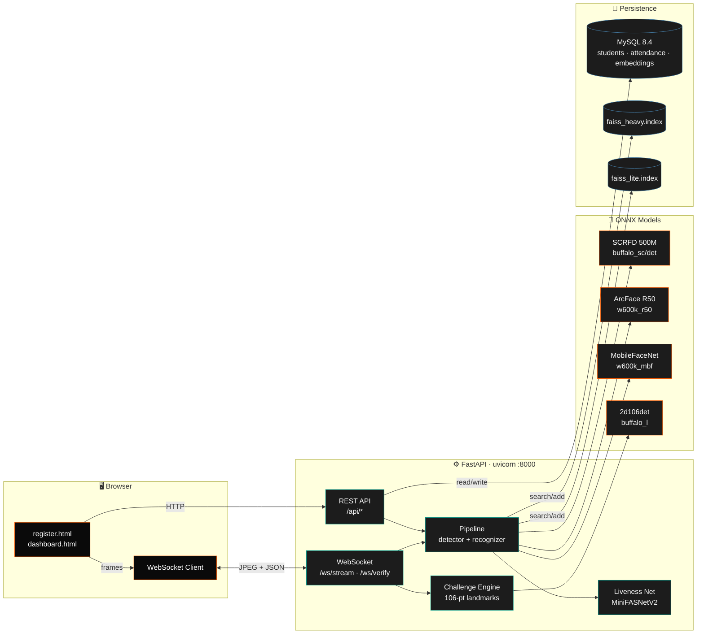
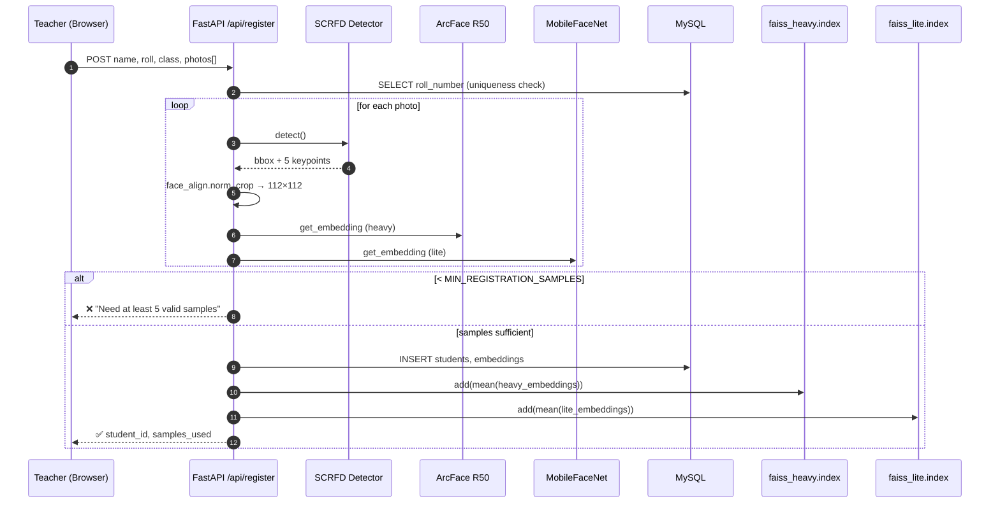
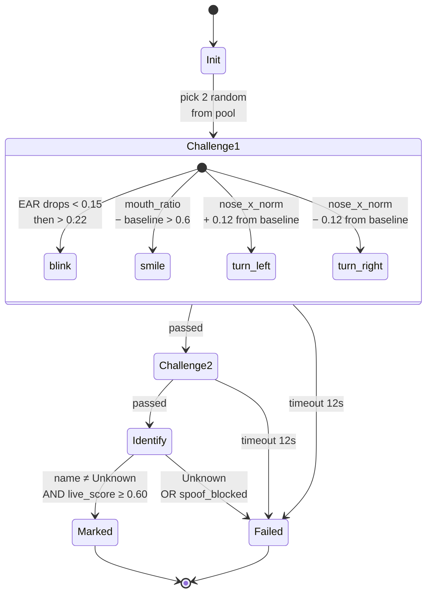
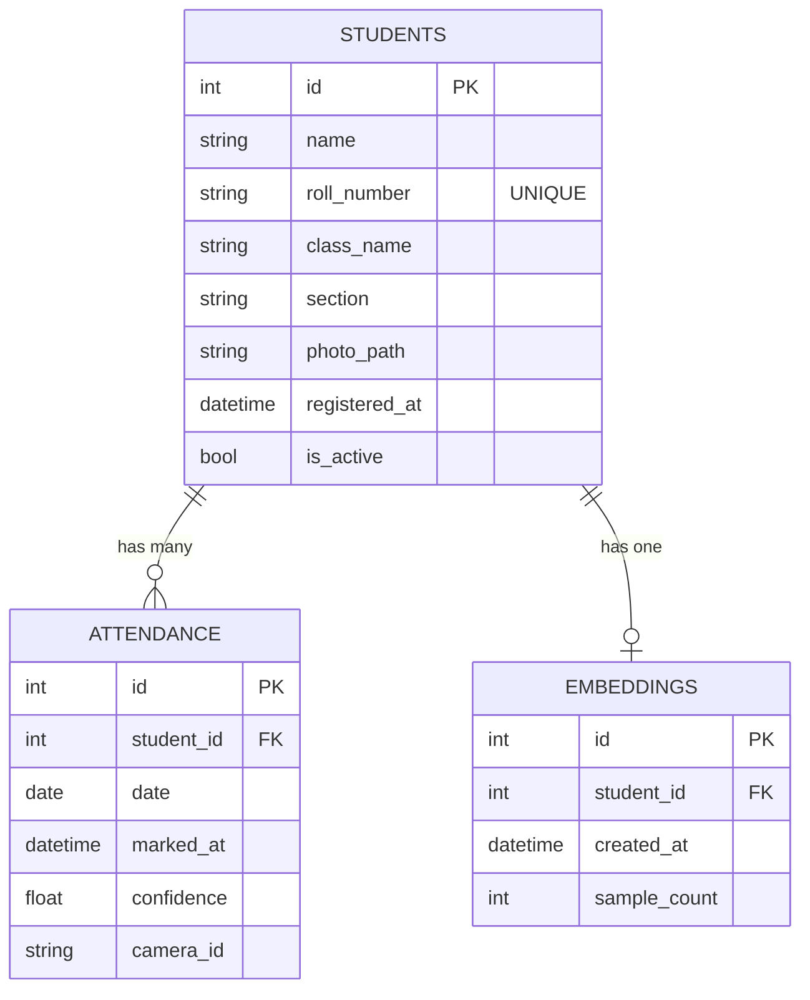

<div align="center">

```
╔══════════════════════════════════════════════════════════════════════════╗
║                                                                          ║
║       █████╗ ██╗      ██████╗ ██╗ ██████╗  ██████╗  ███████╗             ║
║      ██╔══██╗██║      ██╔══██╗██║██╔════╝ ██╔═══██╗ ██╔════╝             ║
║      ███████║██║      ██████╔╝██║██║  ███╗██║   ██║ █████╗               ║
║      ██╔══██║██║      ██╔══██╗██║██║   ██║██║   ██║ ██╔══╝               ║
║      ██║  ██║██║██╗   ██║  ██║██║╚██████╔╝╚██████╔╝ ███████╗             ║
║      ╚═╝  ╚═╝╚═╝╚═╝   ╚═╝  ╚═╝╚═╝ ╚═════╝  ╚═════╝  ╚══════╝             ║
║                                                                          ║
║              S C H O O L  ·  F A C E  ·  A T T E N D A N C E             ║
║                                                                          ║
╚══════════════════════════════════════════════════════════════════════════╝
```

###### A real-time, anti-spoof face-recognition attendance pipeline.
###### FastAPI · InsightFace · FAISS · MySQL · OpenCV


</div>

---

## ❍ &nbsp; Synopsis

A production-grade face-recognition attendance system for schools. Students register
once with a handful of photos; afterwards the system identifies them from a live
webcam feed, blocks photo/video spoofing through an active liveness challenge, and
writes a single attendance record per student per day to MySQL.

The pipeline runs in two interchangeable modes:

| Mode | Detector | Recognizer | Use case |
|------|----------|------------|----------|
| **⚡ Lite**  | SCRFD @ 320×320 | MobileFaceNet (`w600k_mbf.onnx`, 13 MB)  | Low-end PCs, real-time on CPU |
| **🎯 Heavy** | SCRFD @ 640×640 | ArcFace R50    (`w600k_r50.onnx`, 174 MB) | Maximum accuracy, small faces |

Switch live from the dashboard — no restart required.

---

## ❍ &nbsp; What Makes It Real

```
  ┌─────────────────────┬──────────────────────────────────────────────┐
  │  Active liveness    │  4 random challenges — blink, smile,         │
  │                     │  turn left, turn right — driven by 106-pt    │
  │                     │  facial landmarks. Photos and videos fail.   │
  ├─────────────────────┼──────────────────────────────────────────────┤
  │  Passive anti-spoof │  MiniFASNetV2 ONNX runs alongside the        │
  │                     │  challenge to catch screen-replay attacks.   │
  ├─────────────────────┼──────────────────────────────────────────────┤
  │  Dual-mode FAISS    │  Separate IndexFlatIP (cosine) per backend;  │
  │                     │  registrations populate both indices at once.│
  ├─────────────────────┼──────────────────────────────────────────────┤
  │  WebSocket overlay  │  Live JPEG frames + JSON progress events on  │
  │                     │  a single socket — UI overlays in real time. │
  ├─────────────────────┼──────────────────────────────────────────────┤
  │  One-record-per-day │  Enforced at the schema level via a UNIQUE   │
  │                     │  KEY (student_id, date) — no duplicates.     │
  └─────────────────────┴──────────────────────────────────────────────┘
```

---

## ❍ &nbsp; System Architecture



---

## ❍ &nbsp; Registration Flow

When a teacher submits photos, the system embeds the face in **both** model spaces
so a later mode-switch never invalidates a registration.



---

## ❍ &nbsp; Verification Flow (Active Liveness)

```mermaid
sequenceDiagram
    autonumber
    participant U as Browser
    participant WS as /ws/verify
    participant CAM as cv2.VideoCapture(0)
    participant LM as 2d106det Landmarks
    participant CH as Challenge State Machine
    participant LIV as MiniFASNetV2
    participant REC as Recognizer
    participant DB as MySQL

    U->>WS: connect
    WS->>WS: pick 2 random challenges<br/>from {blink, smile, turn_left, turn_right}
    WS-->>U: {type:"init", challenges}
    loop every frame (~20 fps)
        WS->>CAM: read()
        WS->>LM: get_landmarks(frame)
        LM-->>WS: 106 points
        WS->>CH: update(metrics)
        WS->>LIV: check(face_crop)
        LIV-->>WS: live_score
        WS-->>U: JPEG frame + {progress, label, metrics}
        alt challenge.passed
            WS->>WS: advance to next challenge
        else timeout > 12s
            WS-->>U: {done, success:false, reason:"timeout"}
        end
    end
    WS->>REC: identify(aligned_face)
    REC-->>WS: name, confidence
    alt name ≠ Unknown AND avg_live ≥ 0.60
        WS->>DB: INSERT attendance (UNIQUE on student_id+date)
        WS-->>U: {done, success:true, name, confidence}
    else
        WS-->>U: {done, success:false, spoof_blocked}
    end
```



---

## ❍ &nbsp; Liveness Challenge State Machine



The detection metrics computed every frame:

| Metric | Formula | Used by |
|--------|---------|---------|
| `EAR` (Eye Aspect Ratio) | `(‖p1-p5‖ + ‖p2-p4‖) / (2·‖p0-p3‖)` | blink |
| `mouth_ratio`            | `‖m_right - m_left‖ / ‖m_top - m_bottom‖` | smile |
| `nose_x_norm`            | `(nose.x − face_center.x) / face_width` | turn_left, turn_right |

---

## ❍ &nbsp; Data Model



> **Daily-uniqueness invariant.** `attendance` carries
> `UNIQUE KEY (student_id, date)` — a second mark on the same day silently
> short-circuits to `already_marked` rather than throwing.

---

## ❍ &nbsp; Tech Stack

| Layer | Component | Role |
|-------|-----------|------|
| **Web** | FastAPI 0.136 · Uvicorn · WebSockets | REST + binary-stream transport |
| **Vision** | InsightFace 0.7.3 (`buffalo_sc`, `buffalo_l`) | SCRFD detection + 106-pt landmarks |
| **Recognition** | ArcFace R50 / MobileFaceNet (ONNX Runtime) | 512-d embeddings |
| **Anti-spoof** | MiniFASNetV2 (ONNX) | Passive liveness score |
| **Search** | FAISS `IndexFlatIP` | Cosine similarity over normalized embeddings |
| **Storage** | MySQL 8.4 + `mysql-connector-python` | Students · attendance · embedding metadata |
| **Image I/O** | OpenCV 4.9 · NumPy 1.26 · Pillow 12 | Decode, align, encode JPEG |
| **Frontend** | Vanilla HTML + WebSocket + CSS | Zero build step |

---

## ❍ &nbsp; Project Layout

```
AI Pipeline Engineer/
└── school_attendance/
    ├── main.py                    ← FastAPI app + WebSocket endpoints
    ├── config.py                  ← env vars, MODE, faiss_paths()
    ├── database.py                ← MySQL connection factory
    ├── schema.sql                 ← students · attendance · embeddings
    ├── requirements.txt
    │
    ├── pipeline/
    │   ├── detector.py            ← SCRFD wrapper (lite/heavy det_size)
    │   ├── recognizer.py          ← Direct ONNX ArcFace inference
    │   ├── liveness.py            ← MiniFASNetV2 passive check
    │   ├── challenges.py          ← 106-pt landmark challenges
    │   └── attendance_logic.py    ← mark_attendance · lookups
    │
    ├── static/
    │   ├── index.html             ← Landing page
    │   ├── register.html          ← Capture-and-enroll UI
    │   └── dashboard.html         ← Live feed · mode toggle · verify modal
    │
    ├── embeddings/                ← FAISS indices (per mode)
    │   ├── faiss_heavy.index
    │   ├── faiss_lite.index
    │   ├── names_heavy.pkl
    │   └── names_lite.pkl
    │
    ├── models/
    │   └── 2.7_80x80_MiniFASNetV2.onnx
    │
    ├── start.bat                  ← One-shot launcher (Windows)
    ├── start_mysql.bat            ← Boots local mysqld if not running
    ├── stop_all.bat
    └── camera_client.py           ← Optional remote-camera client
```

---

## ❍ &nbsp; Setup On Another PC

> Tested on **Windows 11 / Python 3.11 / MySQL 8.4**. Linux works with minor
> path edits.

### 1 · Prerequisites

| Tool | Version | Notes |
|------|---------|-------|
| Python | **3.11** | InsightFace wheel is `cp311` — do not skip |
| MySQL Server | 8.x | Port 3306 default |
| Git | any | |
| Webcam | any | Built-in or USB |

### 2 · Clone

```bash
git clone https://github.com/AI-SATA-Technologies/AI-Pipeline-Engineer.git
cd "AI-Pipeline-Engineer/school_attendance"
```

### 3 · Virtualenv + Dependencies

```powershell
python -m venv venv
venv\Scripts\activate
pip install --upgrade pip
pip install -r requirements.txt
```

> **InsightFace gotcha.** `requirements.txt` references a local wheel
> (`insightface-0.7.3-cp311-cp311-win_amd64.whl`). Drop that wheel in
> `school_attendance/` before installing, or run
> `pip install insightface==0.7.3` and let pip build it (needs C++ build tools).

### 4 · ONNX Model Cache

InsightFace downloads model packs to `~/.insightface/models/` on first use.
Pre-warming the cache avoids a slow first request:

```bash
python -c "import insightface; insightface.app.FaceAnalysis(name='buffalo_sc').prepare(ctx_id=0)"
python -c "import insightface; insightface.app.FaceAnalysis(name='buffalo_l').prepare(ctx_id=0)"
```

This populates:

```
~/.insightface/models/buffalo_l/   →  w600k_r50.onnx + 2d106det.onnx + …
~/.insightface/models/buffalo_sc/  →  w600k_mbf.onnx + det_500m.onnx
```

### 5 · MySQL

```sql
mysql -u root -p < schema.sql
```

### 6 · `.env`

Create `school_attendance/.env`:

```env
DB_HOST=localhost
DB_USER=root
DB_PASS=your_password
DB_NAME=school_attendance

MODE=heavy
LIVENESS_THRESHOLD=0.60
SIMILARITY_THRESHOLD=0.40
MIN_REGISTRATION_SAMPLES=5
```

### 7 · Run

```bash
.\start.bat
```

Then open:

| Page | URL |
|------|-----|
| Live attendance dashboard | `http://localhost:8000/static/dashboard.html` |
| Student registration | `http://localhost:8000/static/register.html` |
| Auto-generated API docs | `http://localhost:8000/docs` |
| JSON status probe | `http://localhost:8000/api/status` |

---

## ❍ &nbsp; Configuration Reference

| Variable | Default | Effect |
|----------|---------|--------|
| `MODE` | `heavy` | `lite` swaps to MobileFaceNet + 320×320 detector |
| `LIVENESS_THRESHOLD` | `0.60` | Passive liveness cutoff (avg over verification window) |
| `SIMILARITY_THRESHOLD` | `0.40` | Cosine score below this → `Unknown` |
| `MIN_REGISTRATION_SAMPLES` | `5` | Photos that must yield a valid embedding |
| `CAMERA_INTERVAL` | `5` | Frame interval for the optional `camera_client.py` |
| `DB_*` | — | MySQL credentials |

---

## ❍ &nbsp; API Surface

| Method | Path | Purpose |
|--------|------|---------|
| `GET`    | `/api/status` | Health + mode + index size |
| `GET`    | `/api/mode` | Current pipeline mode |
| `POST`   | `/api/mode` | Hot-swap mode (`lite` ⇄ `heavy`) |
| `POST`   | `/api/register` | Enroll a student (multi-photo) |
| `POST`   | `/api/process-frame` | Single-frame detect + recognize + mark |
| `GET`    | `/api/attendance` | Filtered attendance log |
| `GET`    | `/api/attendance/export` | CSV export by date |
| `GET`    | `/api/students` | Active students roster |
| `DELETE` | `/api/student/{id}` | Soft-delete (`is_active=0`) |
| `WS`     | `/ws/stream` | Live preview (no marking) |
| `WS`     | `/ws/verify` | Active-liveness verify + mark |

---

## ❍ &nbsp; Mode Comparison

```
                  ⚡ LITE                              🎯 HEAVY
                  ──────                               ───────
  Detector    │   SCRFD 500M  · 320×320           │   SCRFD 500M  · 640×640
  Recognizer  │   MobileFaceNet · 13 MB           │   ArcFace R50    · 174 MB
  Embedding   │   512-d                            │   512-d
  Speed (CPU) │   ~25–35 ms / frame               │   ~90–140 ms / frame
  Accuracy    │   Good (close-range, single face) │   Excellent (small/angled faces)
  FAISS Index │   embeddings/faiss_lite.index     │   embeddings/faiss_heavy.index
```

> **Embeddings from R50 ≠ MobileFaceNet** — they live in different spaces.
> Registration always writes both to keep the indices in sync.

---

## ❍ &nbsp; Troubleshooting

| Symptom | Cause | Fix |
|---------|-------|-----|
| `Only 0 valid face samples found` | Faces not detected in upload | Use bright photos, single face, looking ahead |
| `Unknown` returned for known student | Liveness blocking, threshold too high, or wrong mode | Check `/api/status`; verify the right index has the student |
| `mysql.connector.errors.InterfaceError: 2003` | MySQL not running | Run `start_mysql.bat` first |
| Cold start very slow | ONNX models downloading | One-time; see step 4 above |
| Verify modal stuck on "Connecting…" | Webcam in use elsewhere | Close Zoom/Teams/Chrome tabs holding the camera |

Diagnostic scripts shipped in the repo:

```
diagnose.py        → end-to-end pipeline sanity check
live_test.py       → live camera + cosine-similarity readout
liveness_check.py  → MiniFASNetV2 score on a known photo
verify_live.py     → FAISS top-k for the current camera face
```

---

## ❍ &nbsp; Roadmap

```
✓  Dual-mode pipeline (lite / heavy)
✓  Active 4-challenge liveness
✓  Passive MiniFASNetV2 anti-spoof
✓  Daily-unique attendance constraint
✓  CSV export
☐  Multi-camera ingestion
☐  GPU runtime (CUDAExecutionProvider)
☐  Per-class scheduling (timetable-aware marking)
☐  Mobile capture client (PWA)
☐  Encrypted embedding store
```

---

## ❍ &nbsp; Team

This is a team project — anyone on the team can clone, configure with their own
`.env`, and run locally. Branch naming: `feature/<short-name>`,
`fix/<short-name>`. Open a PR against `main` for review.

```
   ──────────────────────────────────────────────────
                    C R E A T E D    B Y
   ──────────────────────────────────────────────────

                          ┌────┐
                          │ R1 │
                          └────┘
```

<div align="center">

###### ─────────────────────────────────────
###### Built for AI-SATA Technologies · 2026
###### ─────────────────────────────────────

</div>
